# Ex02-Outlier

# AIM
You are given bhp.csv which contains property prices in the city of banglore, India. You need to examine price_per_sqft column and do following,

(1) Remove outliers using IQR

(2) After removing outliers in step 1, you get a new dataframe.

(3) use zscore of 3 to remove outliers. This is quite similar to IQR and you will get exact same result

(4) for the data set height_weight.csv find the following

    (i) Using IQR detect weight outliers and print them

    (ii) Using IQR, detect height outliers and print them

# Explanation
An Outlier is an observation in a given dataset that lies far from the rest of the observations. That means an outlier is vastly larger or smaller than the remaining values in the set. An outlier is an observation of a data point that lies an abnormal distance from other values in a given population. (odd man out).Outliers badly affect mean and standard deviation of the dataset. These may statistically
give erroneous results.Most machine learning algorithms do not work well in the presence of outlier. So it is desirable to detect and remove outliers.Outliers are highly useful in anomaly detection like fraud detection where the fraud transactions are very different from normal transactions.

# ALGORITHM
## STEP 1
Read the given Data

## STEP 2
Get the information about the data

## STEP 3
Detect the Outliers using IQR method and Z score

## STEP 4
Remove the outliers

## STEP 5
Plot the datas using Box Plot

# CODE
## (1) & (2) Examine price_per_sqft column and use IQR to remove outliers and create new dataframe
```python
import pandas as pd
import numpy as np
import seaborn as sns
df = pd.read_csv("/content/drive/MyDrive/Colab Notebooks/Semester 3/19AI403 - Data Science/bhp.csv")
df
df.head()
df.describe()
df.info()
df.isnull().sum()
df.shape
sns.boxplot(x="price_per_sqft",data=df)
```
```
q1 = df['price_per_sqft'].quantile(0.25)
q3 = df['price_Aper_sqft'].quantile(0.75)
print("First Quantile =",q1,"\nSecond Quantile =",q3)
IQR = q3-q1
ul = q3+1.5*IQR
ll = q1-1.5*IQR
df1 =df[((df['price_per_sqft']>=ll)&(df['price_per_sqft']<=ul))]
df1
df1.shape
sns.boxplot(x="price_per_sqft",data=df1)
```

## (3) Examine price_per_sqft column and use zscore of 3 to remove outliers.
```python
from scipy import stats
z = np.abs(stats.zscore(df['price_per_sqft']))
df2 = df[(z<3)]
df2
print(df2.shape)
sns.boxplot(x="price_per_sqft",data=df2)
```

## (4)(i) For the data set height_weight.csv detect weight outliers using IQR method
```python
df3 = pd.read_csv("/content/drive/MyDrive/Colab Notebooks/Semester 3/19AI403 - Data Science/height_weight.csv")
df3
df3.head()
df3.info()
df3.describe()
df3.isnull().sum()
df3.shape
```
```
sns.boxplot(x="weight",data=df3)
q1 = df3['weight'].quantile(0.25)
q3 = df3['weight'].quantile(0.75)
print("First Quantile =",q1,"\nSecond Quantile =",q3)
IQR = q3-q1
ul = q3+1.5*IQR
ll = q1-1.5*IQR
df4 =df3[((df3['weight']>=ll)&(df3['weight']<=ul))]
df4
df4.shape
sns.boxplot(x="weight",data=df4)
```

## (4)(ii) For the data set height_weight.csv detect height outliers using IQR method
```python
sns.boxplot(x="height",data=df3)
q1 = df3['height'].quantile(0.25)
q3 = df3['height'].quantile(0.75)
print("First Quantile =",q1,"\nSecond Quantile =",q3)
IQR = q3-q1
ul = q3+1.5*IQR
ll = q1-1.5*IQR
df5 =df3[((df3['height']>=ll)&(df3['height']<=ul))]
df5
df5.shape
sns.boxplot(x="height",data=df5)
```

# OUTPUT
## (1)(2) Examine price_per_sqft column and use IQR to remove outliers and create new dataframe
### Dataset
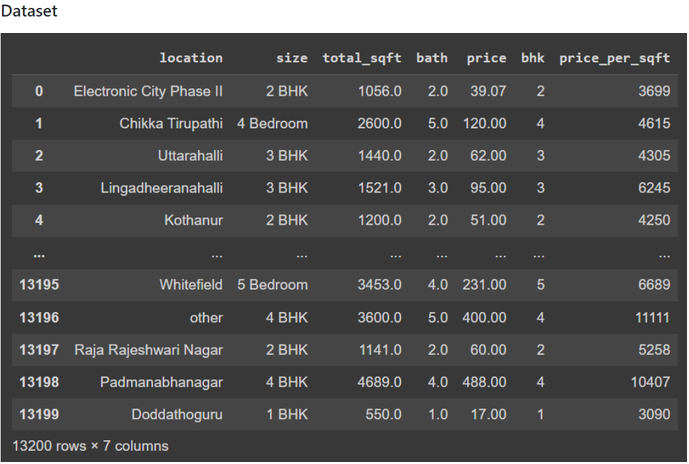
### Dataset Head
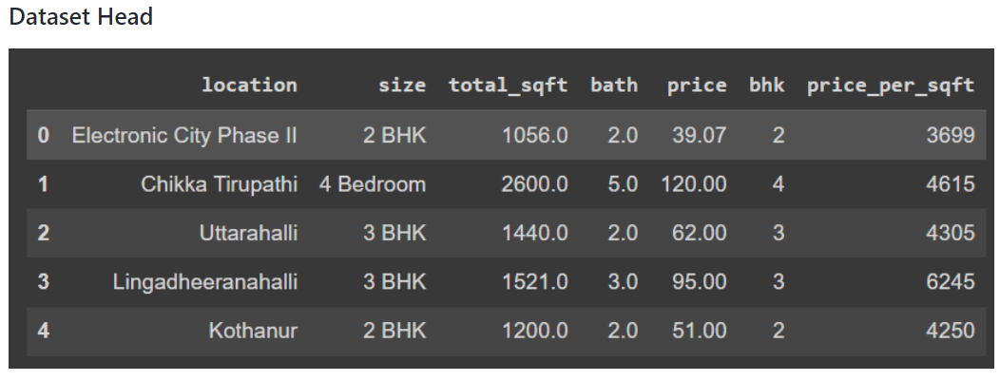
### Dataset Info
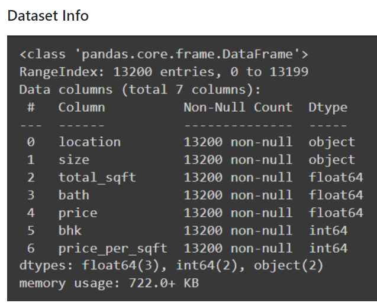
### Dataset Describe
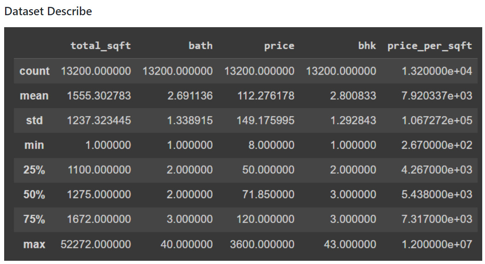
### Null Values
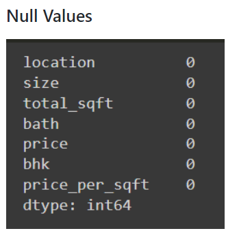
### Dataset Shape
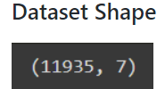
### Box plot of price_per_sqft column with outliers
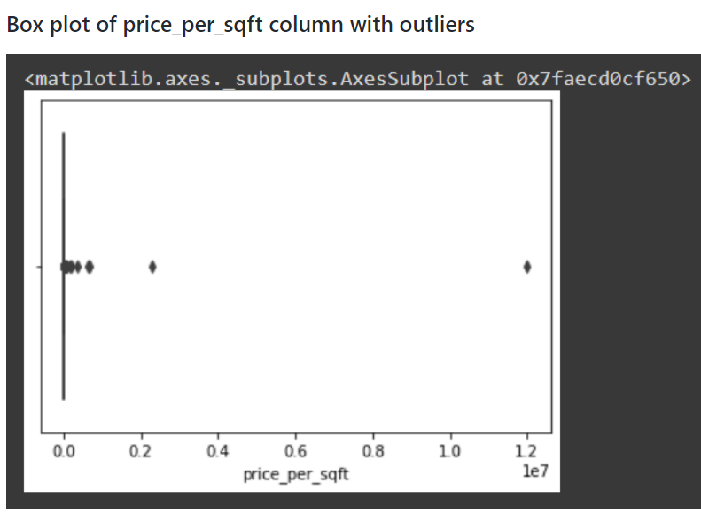
### price_per_sqft - Dataset after removing outliers

### price_per_sqft - Shape of Dataset after removing outliers

### Box Plot of price_per_sqft column without outliers
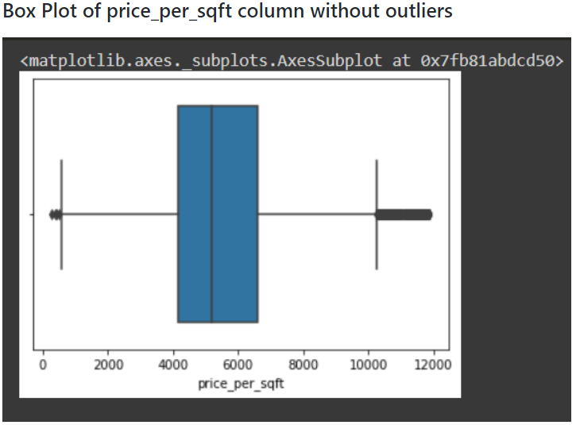

## (3) Examine price_per_sqft column and use zscore of 3 to remove outliers.
### Dataset after removal of outlier using z score
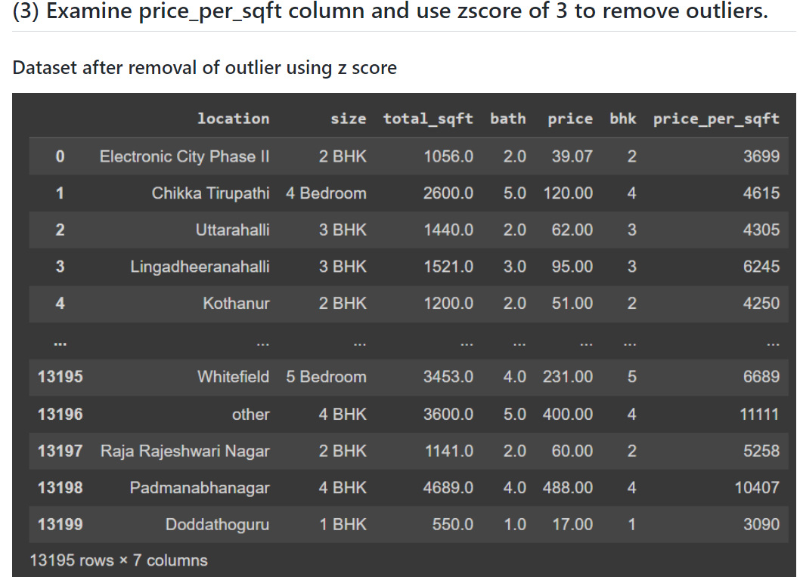
### Shape of Dataset after removal of outlier using z score
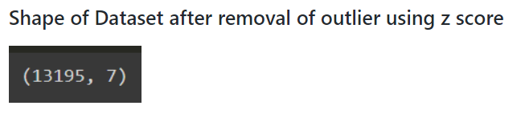
### price_per_sqft column after removing outliers
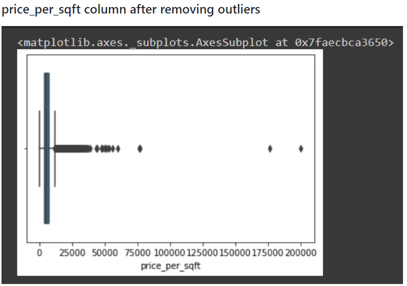

## (4) For the data set height_weight.csv detect weight and height outliers using IQR method
### Dataset
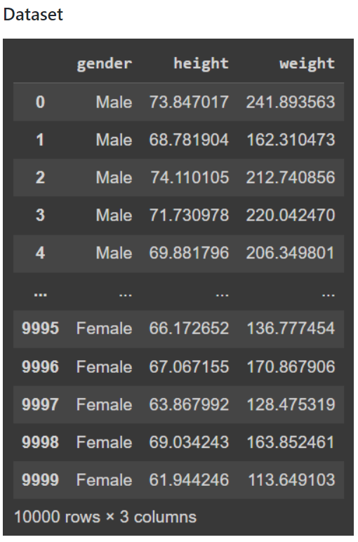
### Dataset Head
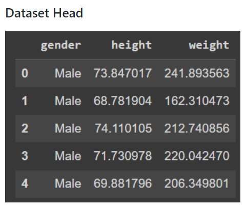
### Dataset Info
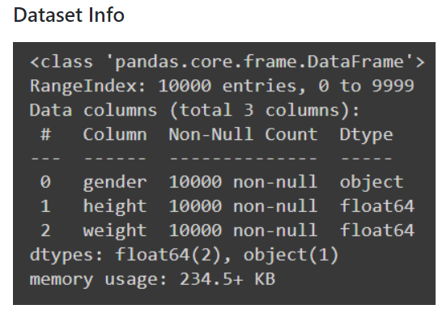
### Dataset Describe
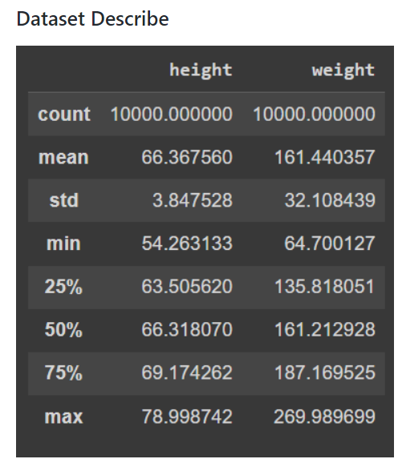
### Null Values

### Dataset Shape
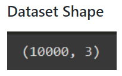
### Weight - With outliers
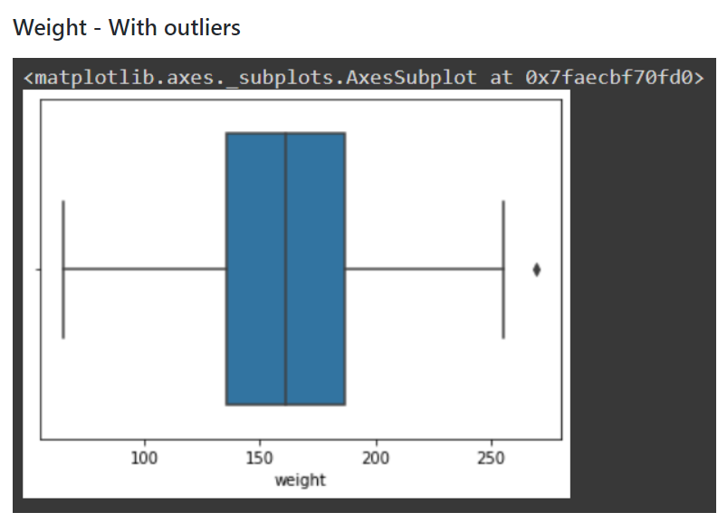
### Weight - Dataset after removing Outliers using IQR method
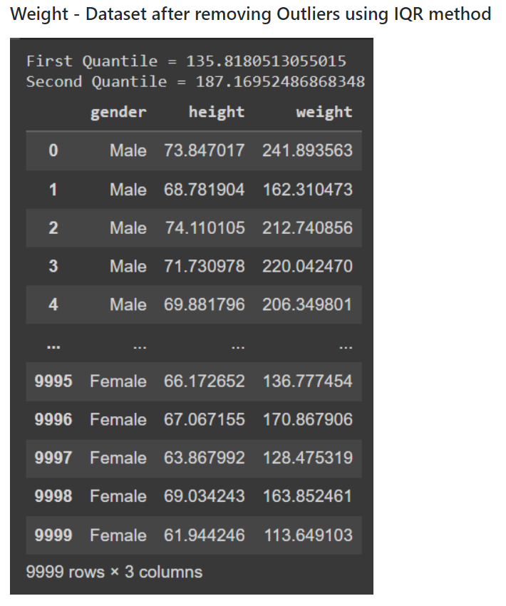
### Weight - Shape of Dataset after removing Outliers using IQR method
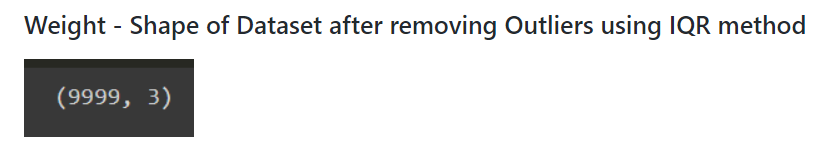
### Weight - Without Outliers using IQR method
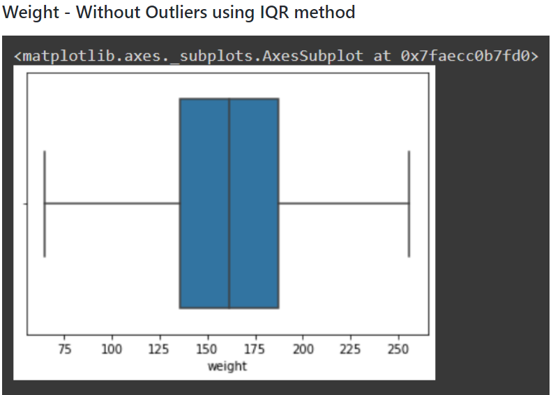
### Height - With outliers
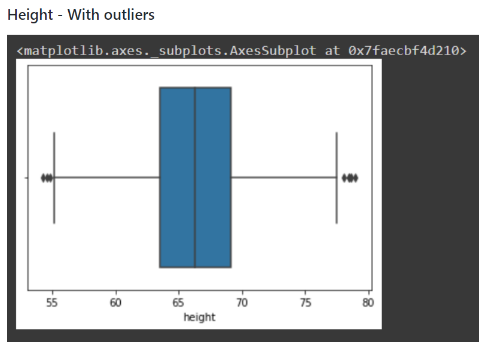
### Height - Dataset after removing Outliers using IQR method
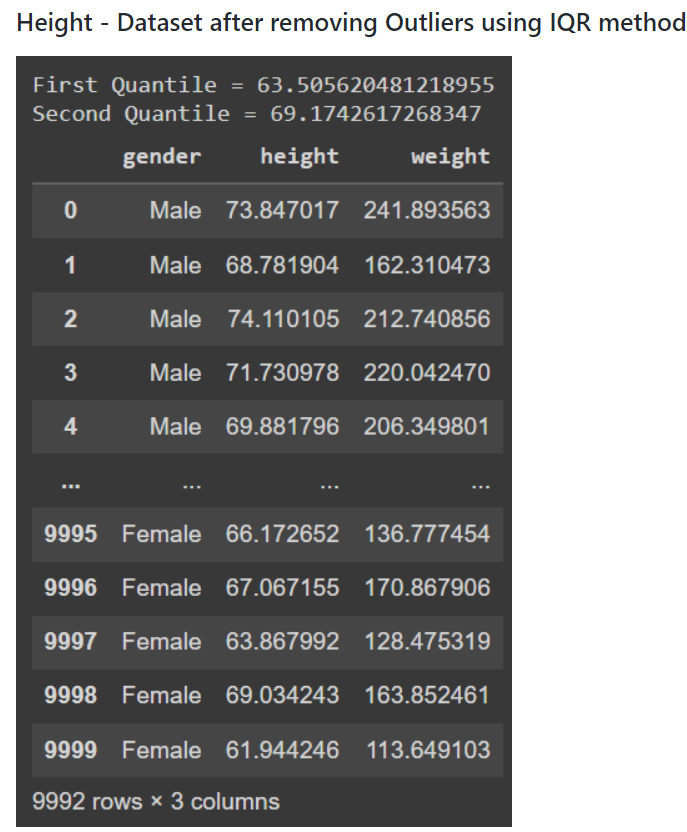
### Height - Shape of Dataset after removing Outliers using IQR method
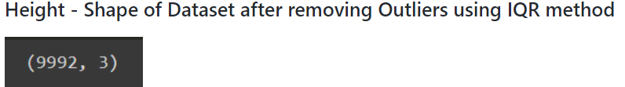
### Height - Without Outliers using IQR method
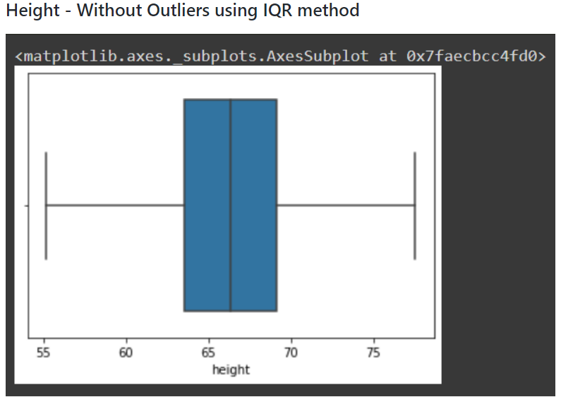

# RESULT
The given datasets are read and outliers are detected and are removed using IQR and z-score methods.
